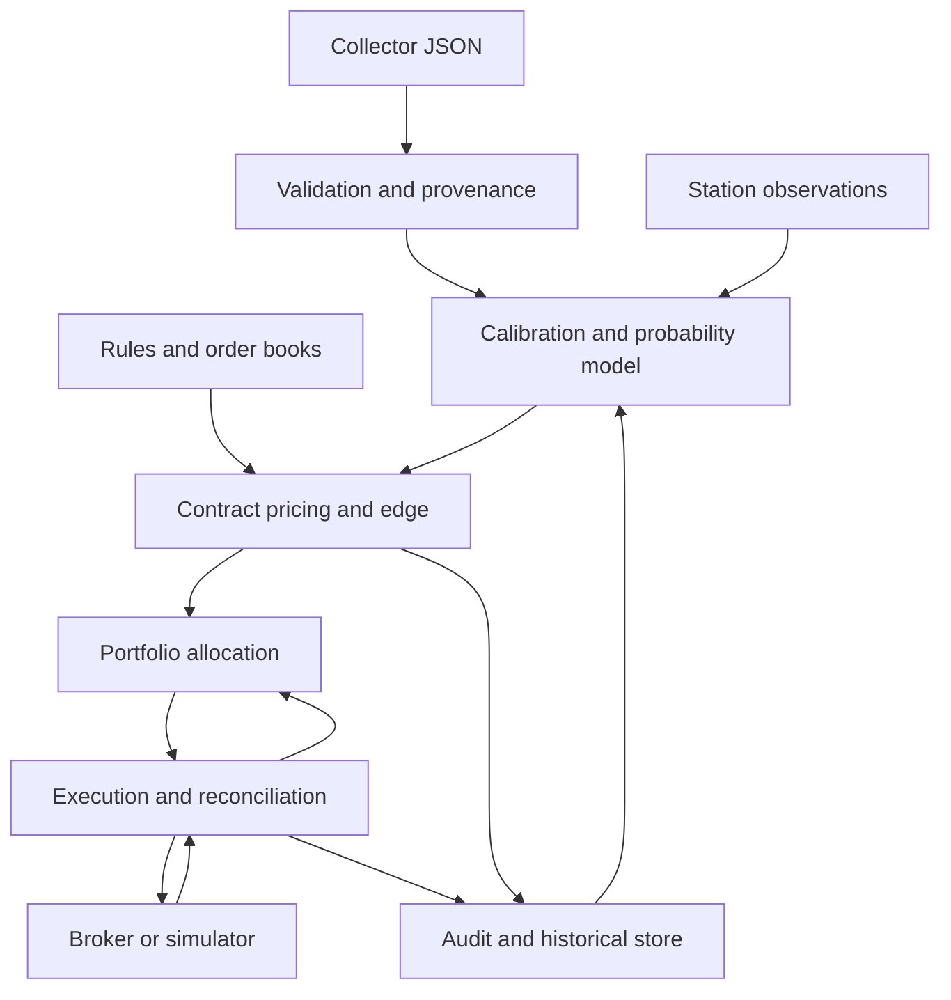

# Kalshi Weather Trading Bot — Codex Build Specification

Version: 1.0 | Prepared: 2026-09-26 (America/Los_Angeles)

## 1. Instructions to the implementing agent

Build a separate Python application, `weather_trading_bot`, downstream of the existing `weather_data_collector`. This document is the implementation contract. Deliver working code, configuration, migrations, meaningful tests, operational documentation, and an offline demonstration. Do not stop at scaffolding or pseudocode. Implement in the milestones below, keeping the application runnable after each milestone.

The goal is to price and trade Kalshi daily maximum-temperature events across configurable cities using GFS, GFS Seamless, NAM, and NBM forecasts. Estimate a calibrated distribution of the official settlement temperature, convert it to contract probabilities, identify positive expected value after costs, and allocate a limited bankroll across opportunities. Buying the most likely bucket is optional: it must pass exactly the same value and risk checks as every other purchase.

Default to offline/paper operation. Implement live execution but do not enable it, submit real orders, transfer money, or change account settings as part of building/testing this project. Owner configuration and an explicit live startup command are required for actual operation. No LLM is needed in the real-time forecasting, pricing, or risk path.

Use the supplied `Los_Angeles,_CA_2026-07-03.json` as a legacy input fixture. Keep collector outputs read-only. The collector repository was not supplied with this specification; do not claim its implementation or data provenance has been verified. If unavailable locally, request the fixture or accept its path as a CLI argument; do not fabricate it.

Requirements marked MUST are release gates. Research extensions are explicitly identified; do not silently present placeholders as finished capabilities. Missing historical data, credentials, or station metadata must produce a useful diagnostic while allowing offline development to continue.

## 2. Scope and operating modes

Required capabilities:

- Multi-city, multi-date ingestion, validation, model lineage tracking, and immutable forecast versioning.
- Station-specific, horizon-aware bias/error calibration and probabilistic ensemble inference.
- Intraday observation conditioning with uncertainty about preliminary versus settlement data.
- Exact event/rule mapping, contract pricing, fees, order-book depth, and value-based signals.
- Joint sizing within an event; portfolio-wide cash, exposure, geographic concentration, and loss limits.
- Limit-order execution, partial fills, cancel/reprice, position exits, restart reconciliation, and kill switches.
- As-of replay backtesting, realistic paper execution, audit records, and performance reporting.
- Configurable scheduling, CLI administration, health/metrics, backups, and unattended process operation.

| Mode | Data and behavior |
| --- | --- |
| `offline` | Fixtures only; no network, credentials, or exchange writes. |
| `backtest` | Replay timestamped historical information with a simulated clock and broker. |
| `paper` | Real market/weather inputs, simulated orders and balances; exchange order writes impossible. |
| `demo` | Kalshi demo environment when supported; separate credentials and accounting. |
| `live` | Real account; explicit configuration, startup flag, and all readiness checks required. |

Initial strategy: long YES contracts, including multiple buckets within an event. Permit selling owned YES inventory to reduce or close positions. Buying NO, shorting, leverage, combos, and other weather market types are out of the initial release. Unknown externally held positions must still be recognized and included in risk or block operation.

## 3. Findings from the actual JSON fixture

The root has `metadata` and `models`. Metadata contains location, target date, one initialization timestamp, variable, and unavailable-model reasons. Each model contains `mean`, `std`, `distribution`, and `daily_high`. The latter includes a derived high, its source, and a sample series. The series is valuable and MUST be retained.

| Model key | Reported mean/high, °F | Reported std, °F | Samples |
| --- | ---: | ---: | ---: |
| `gfs` | 83.23043457031258 | 2.0 | 3 |
| `gfs_seamless` | 83.23043457031258 | 2.0 | 3 |
| `nam` | 79.41062890625001 | 2.0 | 8 |
| `nbm` | 76.73000000000005 | 2.0 | 24 |

Fixture-specific issues:

1. **Duplicate information.** GFS and GFS Seamless have identical means, standard deviations, PMFs, sample temperatures, sample times, and grid points; source paths differ. Treat them as one effective numerical signal in this snapshot unless verified lineage proves additional information. They are not literally identical JSON objects. Do not infer that this `gfs_seamless` is Open-Meteo's product from its name: these paths refer to local GRIB files.
2. **Unverified uncertainty.** All four standard deviations equal 2.0. Their derivation is absent. Import PMFs for compatibility and diagnostics, but label their uncertainty provenance `unknown`; do not treat them as calibrated probabilities for live sizing.
3. **Timestamp ambiguity.** Metadata initialization is `2026-07-03T00:00:00+00:00`. GFS `f018`, `f024`, and `f030` samples are labeled 05:00, 11:00, and 17:00 PDT on July 3. Initialization plus those forecast hours would be 11:00 and 17:00 PDT July 3, and 23:00 PDT July 3. Labels are six hours earlier. This may reflect interval-start labeling of a maximum field rather than corrupt data. Flag `AMBIGUOUS_INTERVAL_TIME`; inspect GRIB reference time, start/end step, statistical processing, and collector logic before deciding. Never silently add six hours.
4. **Station identity is missing.** Location is generic Los Angeles at 34.05223, -118.24368, timezone America/Los_Angeles. It does not establish the Kalshi settlement station. Do not guess LAX, downtown, or any station from the city label.
5. **Window coverage is unverified.** NBM samples run 00:00–23:00 PDT on July 3. A fixed PST reporting day would run 01:00 PDT July 3 to 01:00 PDT July 4, exclusive. The fixture cannot prove coverage of that window. Three GFS records may be interval maxima, not instantaneous readings. A maximum over hourly or three-hourly instantaneous values is also not necessarily the true daily maximum.
6. **Longitude conventions differ.** GFS uses 241.75° east; other records use negative west longitudes. Normalize to [-180, 180), so 241.75 becomes -118.25, while preserving raw values.
7. **Availability is missing.** Run initialization is not publication/download availability. There is no trustworthy time at which this file's information became available to a trader. A historical copy cannot support an execution backtest without an as-of provenance policy.

The fixture MUST parse and produce a validation report, including research-only output when requested. It MUST NOT become live-eligible merely because parsing succeeded. Missing information can be resolved by verified, versioned companion metadata; a blanket `ignore_errors` switch is not acceptable for live mode.

## 4. Architecture and technology

Use Python 3.12+, type annotations, Pydantic schemas, NumPy/SciPy for statistics and constrained optimization, pandas or Polars for research tables, an async HTTP client and WebSocket client, and Decimal/fixed-point monetary arithmetic. Use pytest plus targeted property-based tests. Pin compatible dependency versions in a lockfile. Check current primary documentation when selecting API/library versions.

Use a modular application with one active execution leader and a shared transactional risk ledger. Start with SQLite in WAL mode for a single process and Parquet for bulk historical data; keep persistence behind repositories so PostgreSQL can replace SQLite. Do not start with microservices or require GPUs. A CLI and machine-readable reports are mandatory; a web dashboard is optional.



Recommended package modules:

| Package | Modules / responsibility |
| --- | --- |
| `core` | schemas, Decimal types, UTC clock abstraction, IDs, errors, event bus |
| `weather` | legacy adapter, v2 adapter, validation, lineage, features, window coverage |
| `forecast` | bias correction, distribution models, fit/evaluate, artifacts, registry |
| `observations` | station provider adapters, QC, report revisions, intraday conditioning |
| `markets` | station registry, event discovery, rules/buckets, settlement reconciler |
| `kalshi` | authentication, REST, WebSockets, versioned API translation, fees |
| `strategy` | fair values, robust edge, entry/exit decisions, execution preference |
| `risk` | scenarios, event optimization, portfolio allocator, reservations, limits |
| `execution` | broker interface, live/demo broker, paper broker, durable order state |
| `backtest` | point-in-time replay, fill simulation, evaluation, experiment tracking |
| `storage` | repositories, migrations, raw archives, audit chain, ledger |
| `ops` | scheduler, health, metrics, alert sink, kill switch, CLI |

Every decision component must accept immutable snapshots and an injected clock. Forecast, pricing, and allocation functions should be deterministic given inputs/configuration/artifact version. Keep network calls out of numerical functions.

## 5. Input contracts and normalization

### 5.1 Legacy v1 adapter

Absence of `schema_version` means legacy v1. Preserve the entire original JSON and SHA-256 hash. Map:

| Legacy field | Normalized meaning |
| --- | --- |
| `metadata.location.*` | Requested location; not proof of settlement station |
| `metadata.target_date` | Intended local target date; reporting convention unknown |
| `metadata.initialization` | Claimed common initialization; each model must be verified |
| `metadata.variable` | Expected `daily_high_temperature_f` |
| `metadata.unavailable_models` | Availability and failure reasons; retain exact values |
| `models.<key>.mean` | Collector summary feature, not necessarily calibrated expectation |
| `models.<key>.std` | Collector uncertainty feature with unknown provenance |
| `models.<key>.distribution` | Integer-temperature-keyed PMF; parse keys numerically |
| `daily_high.daily_high_f` | Derived maximum, validated against sample semantics |
| `daily_high.source` | Claimed peak source; opaque provenance, not a file to execute/open automatically |
| `daily_high.samples[]` | Forecast time series; unknown interval semantics until verified |

Validate finite values, units, timestamp offsets, latitude/longitude, sorted unique sample identities, supported variable, model presence, nonnegative PMF probabilities, and PMF sum. Accept floating error ≤1e-6 with logged normalization; reject material discrepancies. Conflicting duplicate times are errors unless separate intervals/variables explain them. Keep out-of-range plausibility thresholds configurable by station and use them as quality checks, not physical certainty.

Check agreement of high, source temperature, mean, and sample maximum within configurable numerical tolerance. Differences can be legitimate in future calibrated summaries; record rather than invent semantics. Missing expected models must have explicit statuses. Unknown model keys may be archived but are not automatically admitted to inference. Read files after atomic producer rename or a stable-size/hash check; quarantine incomplete writes.

### 5.2 Canonical internal entities

All timestamps: timezone-aware UTC internally, with original timezone/string retained when relevant. Money and order quantities: Decimal serialized as strings. Temperature/probabilities: finite floats with explicit units. Immutable IDs and source hashes link entities.

- `ForecastSnapshot`: id, schema version, collector version, content hash, received_at, available_at, availability_quality, requested location, verified station mapping version or null, target date, reporting window or null, model records, validation flags.
- `ModelForecast`: model key, provider/product/version, dependency group, run initialization, publication/availability time, members or quantiles if present, grid point/elevation, interpolation method, variable/height/unit, sample kind, samples, raw derived high, uncertainty provenance, coverage status.
- `ForecastSample`: valid_at, interval_start/end if applicable, interval endpoint convention, forecast_start/end_hour, temperature_f, source reference/hash. For interval maxima, `valid_at` alone is insufficient.
- `Observation`: station, observed_at, published_at, received_at, source/product/version, value/unit/precision, QC, interval maximum if present, preliminary/final status, superseded record reference.
- `EventDefinition`: event/series IDs, date, station, rule hash/version, settlement source and rounding convention, reporting window, close time, settlement status, buckets, exchange price/quantity increments.
- `Bucket`: ticker, lower/upper boundaries and inclusivity, outcome type, payout, exhaustive-set membership. Null boundaries mean unbounded tails.
- `ProbabilityForecast`: station/date/as_of, artifact/input IDs, continuous CDF or discrete PMF, tail handling, expectation/mode/quantiles, calibration tier, uncertainty scenarios, eligibility and reason codes.
- `BookSnapshot`: ticker, exchange/local receive timestamps, sequence, bids/asks with depth, freshness/consistency status.
- `Decision`: event/as_of, fair values, executable prices, fee version, uncertainty adjustment, signals or rejection reasons, proposed quantities, risk snapshot, decision ID.
- `OrderIntent`, `OrderState`, `Fill`, `Position`, `CashLedgerEntry`, `SettlementRecord`: durable identities, exchange/client IDs, side/action, quantity/price, fees, timestamps, causal links, reconciliation status.

### 5.3 Recommended collector v2 additions

Keep v1 ingestion; do not require an immediate collector rewrite to run research. Document a v2 JSON schema and optional companion manifest with these additions:

- Schema/collector version and creation, publication, download, and availability timestamps, with provenance quality.
- Explicit station identifier namespace, source station coordinates/elevation, and target settlement mapping.
- Reporting start/end in UTC, local convention, target date, and coverage assessment.
- Per-model initialization, provider/product/version, upstream model identifiers/dependency groups.
- Per-record GRIB short name, level/height, step type, start/end step, interval semantics, source checksum.
- Sampling/interpolation method and selected grid point/elevation.
- Distribution method (`assumed`, `empirical_residual`, `ensemble`, `native_quantiles`), fit data cutoff, artifact version, and whether values represent density samples or integrated probability masses.
- Native probabilistic products/quantiles when available, without pretending their time window equals the settlement day.

Missing fields remain unknown; never backfill publication time using initialization or historical import time. Prospective `received_at` gives a conservative availability bound; retrospective ingestion does not reconstruct the historical bound.

## 6. Station registry and settlement semantics

Maintain a versioned registry keyed by verified exchange series/station mapping, not a fuzzy city string. Store display city, exchange series ID, station IDs and namespaces, coordinates/elevation, timezone, standard offset/reporting convention, climate product identifier, official source, unit/rounding semantics, verification evidence/date, allowed forecast grid offsets, and regional risk group. Ship an empty or explicitly unverified example registry rather than invented production tickers/stations.

Daily temperature rules identify the authoritative source; current Kalshi guidance describes final NWS Daily Climate Reports and local-standard-time reporting [S1]. Always inspect each event's actual rules. Cache/hash rules, suspend affected entries on a change, and rebuild mapping before resuming. Daily maximum markets only; reject minima, hourly, rainfall, and ambiguously identified events.

Represent reporting windows as half-open intervals `[start_utc, end_utc)`. For a verified fixed-PST July 3 reporting day, the example window is `2026-07-03T08:00:00Z` to `2026-07-04T08:00:00Z`; civil display is 01:00 PDT to 01:00 PDT. Do not apply civil midnight logic or blanket one-hour shifts to all stations/dates. Test DST transitions and no-DST zones.

An interval maximum crossing a boundary cannot be cropped exactly from that aggregate alone. Require suitably bounded records/finer data or label the derived high approximate. Verify full coverage and distinguish instantaneous sample maxima from interval maxima. Learn any sampling bias using the same extraction method used in production.

Keep preliminary reports and later revisions with publication times. Train against the temperature actually used for exchange settlement, retaining links to official reports and discrepancy flags. A later climate revision must not silently rewrite the historical contract payout. Handle delayed, canceled, disputed, and nonstandard resolutions explicitly; never release capital based on presumed next-morning settlement.

## 7. Forecasting model architecture

### 7.1 Target and training rows

Predict `P(Y = integer Fahrenheit settlement temperature | information available at decision time)`. Where rules differ, use a rule-specific observation/rounding model. One training row is station × target date × decision cutoff. Features may only include inputs available by that cutoff. Labels become available only after the corresponding report/settlement was available.

Features: per-model derived highs, bias-corrected highs, model age and lead, cycle, seasonal sine/cosine, missingness, lineage-aware disagreement, grid/station offsets, recent model forecast revisions, and time-series features such as expected peak time and late warming. Optional observations add max-so-far, latest temperature, recent slope, observation age, and forecast-versus-observation residual. Weather-regime features require actual archived inputs; do not invent them from temperature alone.

### 7.2 Baselines and cold start

Implement these explicit model tiers:

1. `collector_pmf_baseline`: diagnostic mixture of validated input PMFs after duplicate grouping; research-only when uncertainty is unverified.
2. `climatology_baseline`: station/season empirical distribution using only prior data.
3. `calibrated_ensemble_v1`: required production candidate described below.
4. `intraday_v1`: separate calibrated observation-conditioned candidate.

With no labeled history, the application can ingest, collect data, show clearly uncalibrated probabilities, and paper trade. It cannot truthfully produce learned weights or calibrated uncertainty. Use pooled station/region/season parameters with shrinkage when local history is sparse; show the fallback tier and validate it separately. Minimum sample counts are configurable and documented. Many snapshots of one day do not count as many independent days.

### 7.3 Required calibrated ensemble

Use an interpretable distributional ensemble before complex neural networks:

1. Estimate signed error `b_m = E(forecast_m - Y)` on training data. Correct with `x_m = forecast_m - b_m`. Use regularized station/season/horizon/cycle effects with pooled fallback; avoid tiny month-by-model cells.
2. Group exact numerical duplicates and known shared-source products. Preserve all records for audit, but represent an identical pair once in mean/spread features. Equality in one snapshot does not prove permanent identity. Estimate residual correlations over history; do not use `sigma / sqrt(number_of_feeds)`.
3. Fit nonnegative weights summing to one over effective source groups, plus a regularized intercept and optional feature effects:

   `mu = intercept + sum(w_m * x_m) + beta · z`

   `S² = sum(w_m * (x_m - sum(w_m*x_m))²)`

   `sigma² = sigma_floor² + softplus(a0 + a1*S² + a2*lead + a3*age + a4*missing_count + gamma · z_scale)`

   Fit coefficients, standardization, and variance floor using training/validation data only. Constrain the direct disagreement coefficient nonnegative initially. Low spread MUST NOT collapse uncertainty: correlated models can agree and all be wrong.
4. Start with a Gaussian location/scale distribution. Fit with discrete-label likelihood or CRPS matching the target semantics; compare a Student-t or empirical-residual alternative if validation shows poor tails. Do not require Gaussian symmetry when evidence rejects it.
5. Fit using chronological folds with city/date grouping, tune regularization on inner folds, and evaluate on untouched outer folds. Any post-calibration transform must use held-out/cross-fitted predictions and preserve a coherent CDF.
6. Missing models use trained missingness patterns or a validated pooled fallback. Renormalizing weights alone does not prove calibration. Unknown patterns block live entries for that event.

Choose the candidate using out-of-sample CRPS, bucket Brier/log scores, interval coverage, and calibration; MAE is a secondary diagnostic. Run comparisons against climatology, individual calibrated models, and duplicate-aware equal weighting. Artifact metadata MUST include station coverage, feature schema, training/data cutoffs, effective date, model versions, validation metrics, code/config hashes, random seed, and approved missingness patterns.

### 7.4 Probability mass and contract conversion

If the settlement convention corresponds to nearest-integer rounding, compute `P(Y=k)=F(k+0.5)-F(k-0.5)`. This is a model convention to verify, not a claim that all source observations use that rule. For other conventions, implement the appropriate observation mapping. Do not treat sampled Gaussian densities as bin probabilities without accounting for bin widths and tails.

Evaluate contract probabilities directly from the CDF or sum the appropriate integer PMF values. For an inclusive 83–84 bucket, sum masses at 83 and 84; handle unbounded tails explicitly. Adaptive numerical support must retain tail mass or achieve a stated tolerance such as 1e-10. Never discard tails and renormalize a short grid into false certainty.

For a complete, mutually exclusive event, fair probabilities sum to one within tolerance. Reject overlapping buckets and unexpected gaps; an intentionally incomplete listed set retains an unlisted-outcome scenario with zero owned payout. Never renormalize probabilities over only tradable buckets.

Generate model-uncertainty scenarios using block/bootstrap refits by date or other validated methods. Produce coherent scenario PMFs. Per-bucket conservative quantiles can screen trades but need not sum to one and MUST NOT be mistaken for the central distribution or used as a joint probability vector.

### 7.5 Intraday update

Use station-specific observed temperatures with provenance, QC, availability times, and reporting-window membership. With a trusted, exact observed maximum `M` and a modeled remaining-window maximum `R`, predict `T=max(M,R)`. This creates an atom at M: `P(T=M)=P(R≤M)`; for higher thresholds use the remaining-maximum distribution. Simply truncating and renormalizing an unconditional daily distribution is not the same model.

Preliminary METAR/other readings can have rounding, sampling, station, and revision differences from final settlement. Represent uncertainty in M and in the final reported value; only impose a hard lower bound when source precision/rules justify it. Calibrate `R` or a direct intraday target using historical as-of observations; never substitute the completed day's observed max into an earlier prediction. Forecast uncertainty need not shrink monotonically when new adverse information arrives.

If observations are stale or unavailable, use a validated forecast-only fallback; otherwise suspend affected new entries. Late-night warming before reporting-window end remains possible. Separate model certainty, contract closure, official report publication, and final exchange settlement.

### 7.6 Extensions, implemented only after baseline evaluation

- Native NBM MaxT quantiles/exceedance products: add a provider interface and documented ingestion plan, then implement when actual product metadata/data are available. Check interval, units, quantile crossings, interpolation, tails, and calibration. NBM probabilistic temperature products exist [S6]; do not hard-code a product version or claim the fixture contains them.
- Market-informed model: record synchronized market probabilities, construct a coherent market distribution from usable quotes, and test a learned convex blend with the weather distribution. Thin books, spreads, and stale prices can make midpoint normalization misleading. Keep disabled until it beats weather-only and market-only baselines out of sample.
- More flexible distribution/quantile regression is optional after sufficient data. New model families must pass the same artifact/version/calibration gates.

## 8. Exchange adapter, pricing, and signals

### 8.1 Market data and rules

Implement paginated discovery for configured series, market metadata/rule retrieval, order books, trades, lifecycle, own orders/fills/positions/balance, and settlement history. Archive rule versions and raw exchange responses. Account for current-versus-historical endpoint boundaries; API candlesticks/trades do not reconstruct historical depth or queue position.

Use REST snapshots plus WebSocket updates. Sequence gaps, reconnects, out-of-order messages, or inconsistent books require resynchronization before pricing. Track exchange and receive times. Debounce rapid updates without hiding relevant changes; reserve rate-limit capacity for cancellation/reconciliation. API limits are discovered/configured rather than assumed permanent.

Kalshi's documented book representation exposes YES and NO bids; implied YES ask is `1 - best NO bid`, with corresponding depth [S2]. Versioned adapters MUST translate this correctly. Empty sides mean unavailable liquidity, not a zero-dollar price. Use executable depth-weighted costs, not last trade or midpoint, for purchase EV.

Current documentation includes fixed-point prices/quantities and a V2 order shape with single-book bid/ask sides [S3]. Keep strategy actions (`BUY_YES`, `SELL_OWNED_YES`) independent of API shapes. Verify supported endpoints, authentication, ticks, quantity increments, and action mappings before implementation. Do not paste a legacy `yes/no + buy/sell` payload into a newer endpoint.

### 8.2 Fee engine

Create a versioned `FeeSchedule`/`FeeEstimator` interface covering market/series rules, maker/taker status, order/fill granularity, effective dates, quantity/price, and account rounding. Fee treatment can vary [S4]; rounding and rebates can depend on fills within an order [S5]. Fetch metadata where exposed; otherwise use a reviewed, versioned schedule. Unknown applicable fees block entries.

Keep all monetary calculations exact to supported precision. Compare estimated fees with actual fill fees and alert on discrepancies. Do not assume maker fees are zero, nor hard-code one timeless fee coefficient. Partial fills, mixed maker/taker orders, and small orders require explicit rounding tests.

### 8.3 Entry logic

For a purchase of n YES contracts with expected payout probability q:

`EV(n) = n*q - executable_purchase_cost(n) - expected_entry_fees(n) - additional_execution_buffer(n)`

For a uniform price p and per-contract cost c, this reduces to `q - p - c`. A payout is $1 per winning contract under the standard assumed contract; validate the event payout. Spread is already included when using the ask: do not subtract it again. If the strategy plans an early exit, evaluate exit cost/fees in that separate model. Holding-to-settlement and active-exit estimates must not be conflated.

Screen using a conservative q estimate or explicit uncertainty penalty, plus a minimum residual edge. These margins are research parameters, not guaranteed protection. Return central EV and conservative EV separately. Apply the same screen to modal and nonmodal buckets. Example: q=0.36, ask=0.25 gives $0.11 gross EV per contract before costs; q=0.44 at ask=0.50 is not a buy just because it is the most likely bucket.

Select quantity jointly with risk and depth; the last marginal unit must still pass cost/edge constraints. Record why each candidate was accepted or rejected. There is no requirement to trade daily or allocate all cash.

### 8.4 Position maintenance and exits

Reprice on new forecasts, observations, meaningful book changes, rule changes, and fills. Cancel unfilled entries whose edge or eligibility disappeared. Selling existing inventory is a distinct decision: compare net executable sale proceeds with current holding value and portfolio utility, accounting for exit fees and risk needs. A new-entry threshold failure alone is not a forced sale.

Allow risk-reducing exits, configurable maximum holding horizon/close buffer, and take-profit logic based on current valuation, not an arbitrary purchase-price multiple. No blind stop-market liquidation in thin books. Use inventory-limited sell orders, exchange reduce-only where supported, and conservative price limits. Prevent simultaneous conflicting buy/sell intents and self-trades.

## 9. Bankroll allocation and risk

### 9.1 Accounting and reservations

Maintain separate cash, order reservations, held inventory, liquidation marks, cost basis, realized P&L, unrealized P&L, fees, and pending settlement cash. Never use expected winnings as spendable cash. Reconcile exchange balance semantics before interpreting available versus total balance; do not subtract the same reservation twice.

Every new order reserves worst-case purchase cost plus fees transactionally before submission. Reservations survive timeouts and restarts. Release only after authoritative rejection/cancellation/expiry or after conversion into a fill/cash debit. Cancel-pending orders remain potentially fillable. Reject a plan if all concurrent permitted fills could breach a limit.

Sizing uses a configurable dedicated bot bankroll, not the user's entire account by default. Unknown/manual positions and pending orders must be included in account-wide limits. By default, do not cancel orders outside this bot's ownership namespace; halt and report unreconciled exposure instead.

### 9.2 Joint event allocation

Do not independently Kelly-size mutually exclusive buckets. For one event let:

- C = cash allocated to this isolated optimization, after external obligations/reserves.
- h_j = existing YES holdings in bucket j.
- b_i, s_i = proposed nonnegative buy/sell quantities, with s_i ≤ h_i and valid lot increments.
- B_i(b_i), S_i(s_i) = depth-aware gross buy costs and sell proceeds.
- F(b,s) = all applicable incremental fees/costs.
- q_j = probability of settlement outcome j, including any unlisted outcome.

Then terminal wealth in outcome j is:

`W_j = C - Σ B_i(b_i) + Σ S_i(s_i) - F(b,s) + h_j + b_j - s_j`

The payout term for an unlisted outcome is zero. Existing inventory is already paid for: do not subtract its original cost again. Optimize expected log terminal wealth `Σ q_j*log(W_j)` subject to cash, positive-wealth floor, inventory, depth, lot, event, bucket, and portfolio constraints. Use the current-position plan as an available feasible option. Model-uncertainty scenarios can replace the objective with a documented worst-case/scenario-penalized version.

The binary isolated-position identity `f=(q-p)/(1-p)` is only a sanity check for bankroll fraction spent at price p with no fees and no existing exposure. It is not the multi-bucket allocation algorithm.

Support fractional Kelly via a documented implementation: compute the feasible full target and scale only risk-increasing changes from current positions by λ, then quantize and recheck all constraints. Do not attenuate mandatory risk-reducing exits. A default research λ=0.10 is an experiment setting, not an optimal allocation recommendation. Reserve an absolute cash floor so no scenario reaches nonpositive wealth.

Implement a continuous relaxation plus feasible lot rounding/repair, or a constrained incremental allocator if the solver cannot handle costs/lots directly. After rounding, recompute fees, marginal EV, cash, and worst-case losses. Include a small-event brute-force oracle in tests. Solver failure/time budget exhaustion returns no new risk with a reason; it does not fall back to uncapped independent Kelly.

### 9.3 Across events and cities

A central allocator coordinates all event proposals against one cash ledger. Concurrent event workers cannot each spend the same cash. Initially use conservative hierarchical dollar budgets, concentration caps, and stress scenarios rather than falsely assuming city/day outcomes are independent.

Required limits:

- Maximum cost-at-risk and maximum additional commitments per event, bucket, city, date, geographic risk group, and total portfolio.
- Minimum cash reserve, maximum active events/orders, per-order notional/quantity, and participation fraction of visible depth.
- Daily realized loss, daily conservative marked-equity loss, and peak-to-trough drawdown limits.
- Bounds on market spread, data age, quote age, price movement since decision, model eligibility, and execution slippage.

For an event, scenario loss considers total paid premiums/fees minus the payout of the winning bucket. Buying more different buckets does not automatically diversify away cost. Across cities, stress common forecast bias shifts, missed heat/cold fronts, observation failures, correlated losing positions, delayed settlement, and simultaneous fills. Limit geographically related cities even before a reliable residual-correlation model exists.

Later, fit cross-station residual dependence and use joint temperature scenarios (for example, a validated copula/bootstrap). Marginal PMFs alone cannot establish a joint scenario distribution. Validate scenario concentration and tail losses out of sample.

Define daily boundaries explicitly, e.g. UTC for the account risk day while market dates remain station-local. Freeze the day's risk reference equity; deposits must not silently reset a loss halt. Report both conservative executable marks and model-valued equity, but use the former or a documented haircut for controls. No bid means a conservative mark, not the last optimistic trade.

### 9.4 Kill switches

| Trigger | Required behavior |
| --- | --- |
| Unknown station/rules/window or disallowed forecast flags | Block affected entries; cancel their unfilled entry orders when connected. |
| Stale/invalid model, PMF, or observations without validated fallback | Suspend affected events and report reason. |
| Book gap/staleness or disconnection | Block new entries; attempt cancellation through healthy paths; resync. |
| Unknown fee/tick/quantity semantics | Block entries until resolved. |
| Ledger/position mismatch or unknown submission result | Retain reservations, reconcile, block new risk. |
| Loss, drawdown, concentration, or cash limit | Halt risk increases; cancel entry orders; follow configured reduce-only policy. |
| Clock skew, authentication failure, persistence failure | Halt execution; keep evidence and alert. |
| Manual global stop | Persist halt across restart; cancel bot-owned open entries; continue monitoring/reconciliation. |

Halting entries is not liquidation and does not remove existing risk. Network outages may prevent cancellation; record unresolved orders and continue bounded recovery attempts. Manual/loss halts require explicit reset; transient data failures may recover automatically only after documented health checks. Exchange order groups or cancel-on-pause capabilities may supplement local controls where verified, but cannot replace dollar-risk accounting.

## 10. Durable execution engine

Use a durable order state machine: `planned → reserved → submitting → acknowledged/open → partially_filled → filled`, with `cancel_pending`, `canceled`, `rejected`, `expired`, and `unknown` branches. Fills may arrive before acknowledgement or during cancellation. Terminal state changes must preserve all fills.

MUST implement:

1. Unique persistent client order IDs and an outbox/intention log committed before network submission. Validate duplicate-ID behavior for the chosen exchange endpoint.
2. On timeout, treat submission as unknown. Query/reconcile orders and fills before resubmitting. A fresh client ID must not be used to bypass an ambiguous earlier submission.
3. Idempotent fill ingestion with exchange fill IDs and transactional cash/position updates. Deduplicate REST and WebSocket reports; tolerate out-of-order delivery.
4. Startup reconciliation of balances, holdings, open orders, recent fills, reservations, and settlements before accepting new plans. Persist checkpoints but recheck authoritative state.
5. Only one live execution leader through an OS/database lease. Per-account risk reservation is atomic. Lost lease stops submissions.
6. Revalidate quote, fee version, risk, model version, event status, and inventory immediately before submission. Decisions carry expiry and snapshot references.
7. Maker orders use post-only if supported; taker execution uses price-capped marketable limits with supported time-in-force. Batch submissions are not assumed atomic; inspect every result.
8. Reprice with hysteresis/minimum meaningful change to reduce churn. Track queue position where available. Partial fills immediately trigger risk/target reconciliation.
9. Handle pause, close, expiry, invalid tick/lot, insufficient funds, rate limit, maintenance, unavailable market, and authentication errors as distinct states.
10. Bound retries with jitter, circuit breakers, and operation-specific policies. Do not retry mutating requests blindly. Keep cancellation/reconciliation capacity available during bursts.

Maker execution is not automatically free or favorable: fills can be adversely selected. Paper/backtests must capture that limitation. There is no guaranteed fill just because a quote touched the limit price.

## 11. Backtesting, calibration validation, and paper trading

### 11.1 Data acquisition and point-in-time replay

Build ingestion for official settlement labels, archived collector forecasts, prospective order-book snapshots/deltas/trades, fee/rule histories, and observations with revision/publication history. Begin collecting market depth prospectively. Offer forecast-only evaluation when historical book data are unavailable; label it separately from execution performance.

Every input has observed/valid time, availability/publication time, and receive time when known. At replay time t, expose only records actually available by t, and only model artifacts trained using labels available before their training cutoff. Feature scaling, calibration, model choice, and strategy tuning obey the same cutoff.

For historic forecasts lacking availability evidence, either exclude them from executable replay or use a clearly flagged conservative reconstructed publication delay and sensitivity analysis. The original July fixture has unknown availability. Reconstructed-time results cannot be presented as verified historical profitability.

Use rolling-origin train/validation/test splits. Keep all snapshots for the same target date grouped; prevent the same weather event or labels from appearing in both train and validation. For pooled cities, split by date across cities to avoid leakage from shared weather. Use a gap at least sufficient for overlapping target/label windows and publication delays. Keep a final untouched period; report all tested variants to expose selection bias.

### 11.2 Execution simulation

- Replay signals, risk reservations, cancellations, partial fills, fees, positions, settlement, and capital lockup through the same interfaces used live.
- Model feed, decision, submission, and cancellation latency. A decision cannot fill against a stale historical quote after the simulated order arrival.
- Taker fills consume available depth at eligible prices; cap quantity and simulate impact/slippage conservatively. Do not reuse the same depth for multiple simultaneous simulated fills without replenishment.
- Maker fills require a documented queue/volume model and pessimistic sensitivity bounds. Bar high/low or last trade is insufficient evidence of a fill.
- Simulate cancellation/fill races, downtime, missed updates, rounding, and partial-batch outcomes.
- Produce separate results for best-supported fills and conservative alternatives. Fees reflect their effective date, not today's schedule applied silently to old trades.

Paper mode uses identical decision and ledger logic but a broker with no live write capability. Use live quotes and realistic simulated execution. Demo fills validate mechanics, not production liquidity or profitability.

### 11.3 Metrics

Forecast metrics: MAE/RMSE, bias, CRPS, discrete log score, multiclass bucket Brier score (state whether summed or averaged), randomized PIT/reliability, interval coverage/width, and tail-event calibration. Break down by station, season, horizon, cycle, availability pattern, and weather regime when recorded.

Trading metrics: net dollar P&L, fees, return on committed capital with explicit denominator, bankroll return, turnover, fill rate, slippage, holding duration, maximum drawdown, exposure concentration, expected versus realized edge, per-trade/per-day distributions, and rejected-opportunity counts. Report mark-to-market and settled P&L separately. Annualized Sharpe-like metrics require a stated sampling interval and enough history; do not present them as stable facts from a tiny sample.

Use block-bootstrap confidence intervals by date/region where suitable. Record bankroll and deployment constraints. Compare no-trade, climatology, single-model, equal-weight, and market-implied baselines. Forecast skill alone does not prove profitable execution.

## 12. Configuration and operator interface

Provide a validated YAML config and environment-based secrets. The following are illustrative paper/research defaults, not established profitable parameters or a live recommendation:

```yaml
mode: paper
live_enabled: false
station_registry: config/stations.yaml
forecast:
  model: calibrated_ensemble_v1
  allow_uncalibrated_live: false
  require_verified_station_and_window: true
  duplicate_policy: group_identical_signals
strategy:
  allowed_entries: [BUY_YES]
  allow_sell_owned_yes: true
  min_net_edge_per_contract: "0.05"
  uncertainty_policy: bootstrap_lower_quantile
  uncertainty_quantile: 0.10
risk:
  paper_bankroll_usd: "1000.00"
  live_bankroll_usd: null
  fractional_kelly: 0.10
  min_cash_reserve_fraction: 0.50
  max_event_cost_at_risk_fraction: 0.02
  max_bucket_cost_at_risk_fraction: 0.01
  max_city_date_cost_at_risk_fraction: 0.03
  max_region_cost_at_risk_fraction: 0.06
  max_total_cost_at_risk_fraction: 0.10
  daily_loss_halt_fraction: 0.02
  peak_drawdown_halt_fraction: 0.05
  max_order_notional_usd: "10.00"
  max_visible_depth_fraction: 0.10
execution:
  order_type: limit
  max_book_age_seconds: 5
  reconcile_interval_seconds: 30
  single_execution_leader: true
  cancel_bot_entries_on_shutdown: true
storage:
  database_url: sqlite:///data/bot.db
  archive_directory: data/archive
```

All omitted controls (clock tolerance, per-model forecast age, observation age, tick/lot limits, close buffer, rate budgets, minimum sample counts, optimizer timeout, maximum orders/events, and readiness thresholds) require typed fields and documented defaults in the implementation. Cadence/age limits must reflect the actual source, not one arbitrary global weather timeout. Reject contradictory or missing live limits at startup.

Required CLI commands, with `weather-bot` as an example executable name:

- `validate-input PATH --report PATH`: parse, normalize, and report all eligibility flags.
- `ingest PATH_OR_DIRECTORY`: immutable deduplicated archive and normalized records.
- `collect --config PATH`: capture public/authorized data, no order writes.
- `train --config PATH --as-of TIMESTAMP`: produce a versioned calibration artifact and validation report.
- `forecast --station ID --date YYYY-MM-DD --as-of TIMESTAMP`: PMF/CDF, diagnostics, lineage, and eligibility.
- `price --event ID --as-of TIMESTAMP`: bucket fair values, book prices, costs, and reasons.
- `backtest --config PATH`: replay plus machine-readable and human-readable reports.
- `run --mode paper|demo|live --config PATH`: live additionally requires `--enable-live` and explicit nonzero bankroll/limits.
- `status`, `positions`, `orders`, `reconcile`, `halt --reason TEXT`, `resume`, and `report --date DATE`.

Dry-run mode must show concrete intended actions without sending orders. `resume` does not override failing readiness checks. Use structured output formats and nonzero error codes for failures. Do not log private keys, signatures, auth headers, or unrestricted account payloads.

## 13. Persistence, audit, and operations

Persist normalized tables for stations/mappings, event/rule versions, forecasts/models/samples, observations/revisions, settlement labels, model artifacts, books/trades, decisions, intents/orders/fills, cash/positions/reservations, portfolio snapshots, fee schedules, and halt/health events. Use migrations, uniqueness constraints, and indexes on station/date/as_of and exchange identities. Never overwrite history in place.

Each decision audit record includes input/source hashes, runs/availability, raw and corrected forecasts, artifact version, distribution and uncertainty, rule/station mapping, book timestamp/depth, fees, central/conservative EV, allocation, binding limits, intended orders, execution outcomes, and eventual settlement/P&L. A skipped trade has reason codes too. Provide a single-decision replay/explanation command.

Archive bulk data in date-partitioned Parquet or compressed JSON with checksums. Keep small account-critical state transactional; weather/market archives can be append-only. Document backup/restore and retention. Test restoration of order/reservation state before treating the system as operational.

Supply Docker and/or systemd deployment instructions, a sample environment file without credentials, graceful shutdown, automatic restart, log rotation, health endpoint/CLI, and metrics for data freshness, model eligibility, WebSocket gaps, decision latency, order rejections, reconciliation lag, exposure, P&L, and halt state. Secrets stay in environment/secret files with restrictive permissions. Separate demo/live hosts and credentials; config must not silently fall back from demo to production.

Alerts must be configurable and deduplicated. Provide a local console/file sink by default; external notifications require operator configuration. Restarting must not clear a risk halt or resend previous orders. Define degraded operation per event, rather than allowing one bad city to corrupt all forecasts.

Scheduled retraining produces a challenger artifact. Promotion requires validation gates and an auditable command/policy; do not automatically deploy a model solely because its most recent P&L is higher. Watch calibration drift, error shifts, missingness changes, upstream model upgrades, and fee/rule/API changes.

## 14. Required verification and acceptance criteria

Tests must exercise meaningful behavior, including negative cases. Network/credentials are not required for the default test suite. Use official-response fixtures and a scripted fake exchange for integration tests; live tests never place real orders automatically.

| Area | Required acceptance behavior |
| --- | --- |
| Supplied fixture | Parses all four models and 3/3/8/24 samples; retains PMFs/source data; produces diagnostics. |
| Duplicate feeds | Groups GFS/Seamless numerical equality despite different paths; adding a duplicate does not tighten uncertainty or double its influence. |
| Legacy eligibility | Flags unverified station/window, unknown availability/uncertainty, and ambiguous GFS timing; live entry is blocked. |
| Time semantics | Detects six-hour GFS filename/label discrepancy without silently fixing it; interval-start metadata can resolve it explicitly. |
| Coordinate/time conversion | 241.75→-118.25; fixed-PST July window equals 08Z-to-08Z; tests both DST transitions and no-DST zones. |
| Coverage | Boundary-crossing aggregate max cannot be cropped; incomplete day is not certified complete. |
| PMFs/buckets | Negative/NaN/large mass errors fail; tiny float error normalizes; unbounded tails and unlisted outcomes are retained. |
| Probability example | PMF masses 1/3/8/17/27/23/13/6/2% at 80–88 map to ≤80:1%, 81–82:11%, 83–84:44%, 85–86:36%, 87–88:8%, ≥89:0% for this finite synthetic fixture only. |
| Calibration | Bias sign is correct; folds/transform fits cannot see future labels; agreeing sources retain nonzero uncertainty; fallback is explicitly identified. |
| Intraday | Exact M creates mass at M in max(M,R); uncertain preliminary M does not impose unjustified zero probability below a rounded observation. |
| Price/fee math | NO bid 0.56 implies YES ask 0.44; missing side is unavailable; Decimal precision, maker/taker and partial-fill rounding match current fixtures. |
| Signal logic | Most-likely overpriced bucket is rejected; a lower-probability undervalued bucket can be accepted; spread is not double-counted. |
| Event allocation | Brute-force small case agrees within documented tolerance; mutually exclusive payouts, current holdings, fees, cash floors and unlisted outcomes are represented. |
| Portfolio concurrency | Simultaneous event decisions cannot over-reserve cash; resting and cancel-pending orders count toward exposure. |
| Execution recovery | Timeout after accepted order yields one effective order; duplicate fills apply once; partial fill during cancel is retained; restart reconciles before resuming. |
| API faults | Rate limit, stale book, gap, auth failure, rule change, invalid ticks, and maintenance trigger correct block/recovery behavior. |
| Kill switches | Halt persists across restart; no fresh entry after breach; cancellation failure remains visible; existing positions are still monitored. |
| Backtest integrity | Future forecast/report injection cannot affect earlier decisions; revised reports preserve as-of history; unsupported fill claims are rejected/flagged. |
| Mode isolation | Paper/offline brokers cannot call live write methods; demo credentials cannot target production; live defaults disabled. |
| End-to-end | Offline scenario runs input→probabilities→pricing→allocation→simulated partial fills→settlement→P&L, with traceable decisions. |

Also test insufficient funds, canceled/nonstandard settlements, missing models, malformed atomic writes, solver failure, unknown manual positions, and database failure before/after submission. Quantify any numerical tolerance. Do not call an uncalibrated demo a profitable strategy.

## 15. Implementation milestones and definition of done

### Milestone 1 — Inputs, domain, and offline vertical slice

Deliver project packaging, schemas, configuration, storage/migrations, v1 adapter, fixture validation, rule/bucket domain model, diagnostic baseline, fee abstraction, paper broker, CLI, and a synthetic end-to-end scenario. Fixture issues are surfaced. Offline demo works without keys; legacy uncertainty cannot unlock live trades.

### Milestone 2 — Calibration and honest replay

Deliver settlement/observation/forecast ingestion interfaces, point-in-time datasets, required calibrated ensemble, model artifact registry, chronological evaluation, intraday model, and replay engine. With inadequate real data, prove functionality with labeled synthetic fixtures and explicitly report the missing data; do not fabricate fitted production models. Begin prospective book and availability recording.

### Milestone 3 — Market integration, risk, and robust execution

Deliver verified REST/WebSocket adapters, event discovery, station/rule verification workflow, current fee adapter, central reservation ledger, event sizing, cross-city limits, durable reconciliation, fault injection, and paper/demo operation. Live code exists but remains disabled by default. Supply a capability matrix listing complete, data-blocked, and research-only features.

### Milestone 4 — Operational readiness

Deliver operational deployment files, health/alerts, audit/replay/reporting, backup/restore, tested startup/shutdown/halts, and a readiness report. Include exact setup/run commands and data requirements. Live readiness requires verified mappings/windows, reviewed fee/API semantics, an eligible artifact, reconciled account state, explicit bankroll/limits, fault-recovery tests, and owner-enabled configuration. Paper observation time is evidence, not a substitute for adequate independent calibration samples.

### Milestone 5 — Research extensions

Evaluate native NBM distributions, market-informed forecasts, joint cross-city scenarios, alternative residual distributions, and execution improvements. Promote only with evidence against the established baseline. These extensions must have concrete interfaces and documented prerequisites; unavailable external products must not be replaced with fake working integrations.

Final deliverables: runnable repository, dependency lockfile, README, this specification or a linked implementation mapping, example nonsecret configs, JSON schemas, migrations, unit/integration/replay tests, fixture instructions, offline demo, validation/backtest reports, and operations runbook. Report remaining limitations and which data-dependent gates are unmet. Completion means the requested engineering works; it does not imply demonstrated trading profitability.

## 16. Reference sources and maintenance notes

Primary sources checked while preparing this specification on 2026-09-26/27. Recheck them at implementation time and record the API/schema/fee/rule versions used. Market-specific rules outrank general explanatory guidance. Architecture, model choices, and research defaults above are proposed engineering requirements, not claims that Kalshi prescribes this strategy.

- **[S1]** Kalshi, [Weather Markets](https://help.kalshi.com/en/articles/13823837-weather-markets): authoritative-source distinction and local-standard-time reporting.
- **[S2]** Kalshi, [Orderbook Responses](https://docs.kalshi.com/getting_started/orderbook_responses): book representation and complementary bid/ask relationship.
- **[S3]** Kalshi, [Create Order (V2)](https://docs.kalshi.com/api-reference/orders/create-order-v2): current documented order shape. Consult the [API documentation index](https://docs.kalshi.com/llms.txt) and [changelog](https://docs.kalshi.com/changelog) for implementation-time compatibility.
- **[S4]** Kalshi, [Fees](https://help.kalshi.com/en/articles/13823805-fees): varying fee treatment and links to applicable schedules.
- **[S5]** Kalshi, [Fee Rounding](https://docs.kalshi.com/getting_started/fee_rounding): fill-level rounding/accumulation behavior.
- **[S6]** NOAA/NWS, [NBM percentile product notice](https://www.weather.gov/media/notification/pdf_2025/pns25-53_Thinning_of_NBM_Percentiles.pdf): historical documentation of probabilistic maximum/minimum temperature products and proposed changes; verify actual available products/version rather than treating a proposal as operational status.
- **Input evidence:** supplied `Los_Angeles,_CA_2026-07-03.json`, inspected directly. Its unknown provenance fields and temporal ambiguities remain unresolved; no collector source code or raw GRIB headers were provided.

